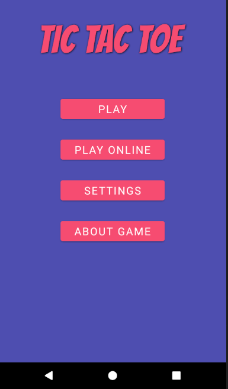
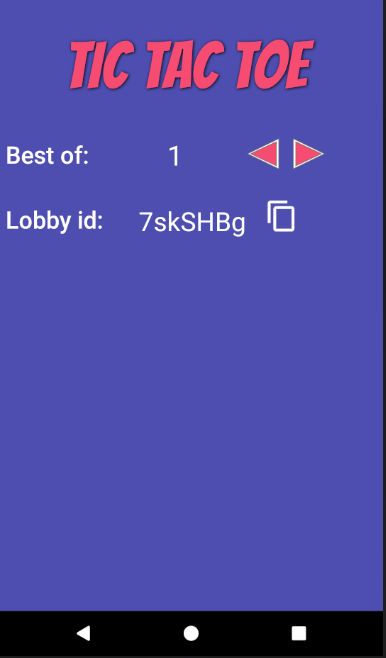
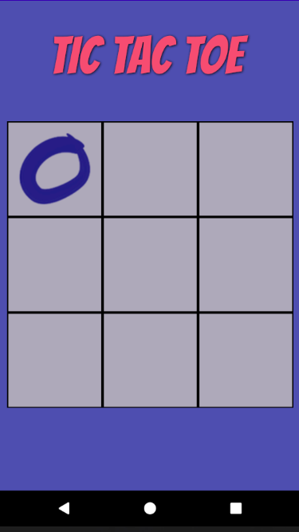

# Tic Tac Toe
> App providing information about rick and morty

## Table of contents
* [General info](#general-info)
* [Screenshots](#screenshots)
* [Technologies](#technologies)
* [Setup](#setup)
* [Features](#features)
* [Status](#status)
* [Inspiration](#inspiration)

## General info
Simple android game Tic Tac Toe with multiplayer mode

## Screenshots

## Technologies
* Kotlin 
* coroutines
* Hilt
* Firebase
* MVVM

## Setup

## Code Examples
coroutine in repository example:
`@ExperimentalCoroutinesApi
    fun initializeGameInDB(lobbyId: String): Flow<Boolean> = callbackFlow {

        val myRef = database.getReference("/$lobbyId").child("active")

        val listener = object : ValueEventListener {
            override fun onDataChange(dataSnapshot: DataSnapshot) {
                if (dataSnapshot.value != null) {
                    myRef.parent?.setValue(Game(1))
                    this@callbackFlow.sendBlocking(true)
                } else {
                    this@callbackFlow.sendBlocking(false)
                }
            }

            override fun onCancelled(databaseError: DatabaseError) {
                this@callbackFlow.sendBlocking(false)
            }
        }
        myRef.addValueEventListener(listener)
        awaitClose {
            myRef
                .removeEventListener(listener)
        }
    }`

## Features
List of features ready and TODOs for future development
* Online multiplayer
* Offline multiplayer ( on 1 phone)
* Ai single player 

To-do list:

## Status
Project is: _complete_

## Inspiration
Project based on game tic tac toe
